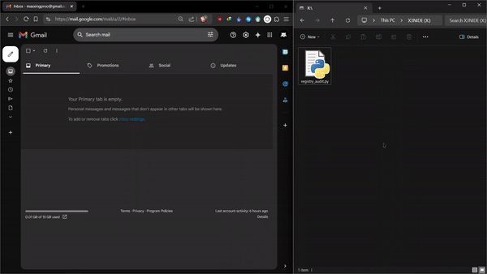

# X3-registry

## Overview
**X3-registry** is a Python-based tool designed to enhance cybersecurity by scanning Windows systems for the presence of unauthorized or high-risk software. It retrieves the list of installed programs from the Windows Registry and compares them against a predefined blacklist. If any blacklisted software is found, an automated email alert is sent to the IT security team. The tool runs without requiring administrator privileges, making it efficient and easy to deploy.



## Features
- Scans the system for installed software from the Windows Registry.
- Detects and flags blacklisted software (e.g., Tenable, Tor, qBittorrent, uTorrent).
- Sends a detailed security alert via email using Gmail SMTP.
- Saves the email content as an HTML file if email sending fails.
- User-friendly terminal output with alerts for detected violations.

## Use Case
X3-registry is particularly useful in corporate environments where IT departments need to ensure that employees are not using unauthorized or insecure software. It's also valuable for routine audits to maintain compliance with software usage policies.

## How It Works
1. **Software Scan**: Retrieves all installed software from the Windows Registry.
2. **Blacklist Check**: Compares installed software against a predefined blacklist.
3. **Alert Generation**: If blacklisted software is detected, the tool generates a detailed HTML email alert.
4. **Email Transmission**: The alert is sent to a specified email address using Gmail's SMTP server. If email fails, the alert is saved locally on the desktop.

## Setup Instructions
1. Clone this repository to your local machine.
   ```bash
   git clone https://github.com/mubbashirulislam/X3-registry.git
   ```
2. Navigate to the project directory.
   ```bash
   cd X3-registry
   ```
3. Install the necessary Python packages:
   ```bash
   pip install smtplib
   ```
4. Update the `from_email` and `password` variables in the `send_email()` function with your Gmail credentials.

5. Run the script:
   ```bash
   python reg_audit.py
   ```

## Customization
- **Blacklist Modification**: You can modify the `blacklist` variable in the script to include the software you want to monitor for.
- **Email Settings**: Replace the placeholders for Gmail credentials in the `send_email()` function with your own.

## System Requirements
- Windows OS
- Python 3.x
- No administrator privileges required

## Disclaimer
This tool is intended for cybersecurity professionals and system administrators. It should be used in compliance with all applicable laws and organizational policies.

## License
This project is licensed under the MIT License - see the [LICENSE](LICENSE) file for details.
```

